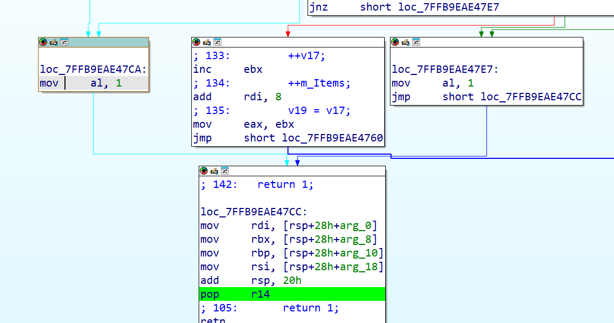
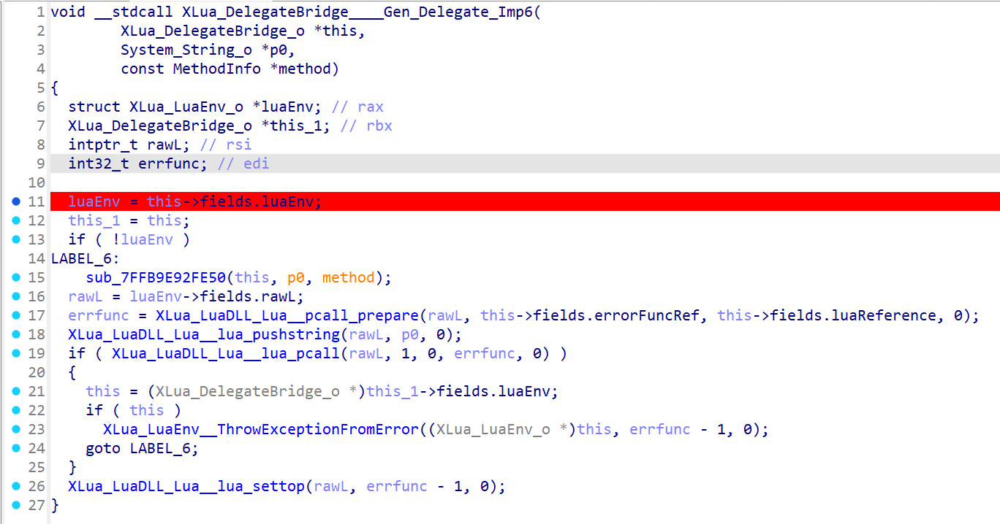

# 说明
本文只是用于学习攻防技术，不用于盈利，请勿利用技术用于非法用途。

# 背景
目前有些游戏会使用联网验证，检查你是否已经购买这个游戏。它会向服务端发起请求，并且返回一些加密串，最终在本地也做一遍加密比较两边结果是否一致。

对称加密相对容易一些，非对称加密的话你就无法获得服务端的密钥，无法伪造请求。

# 一般防逆向措施
1. 每次请求加上时间戳，防止重放攻击
2. 校验码，或者对返回值加密，使用某种方式加密
3. 使用TLS通信，客户端校验证书

# 破解过程
我们知道这个游戏会联网验证，首先想到的是抓包。我用到的工具是Reqable，这个工具抓https比较方便，记得要安装CA证书。

抓包工具开启系统代理，开启抓包，启动游戏，能看到游戏发起了一个请求，但看不到内容。只看到一个CONNECT的请求，提示SSL客户端错误。这个问题是客户端做了证书校验，由于Reqable这类软件抓取https请求是利用中间人的方式，替换了服务器返回的证书才实现的解密，客户端拿到不是真实的证书，拒绝了请求。当然，有些客户端不做校验是可以抓取到的。

## 使用IDA Pro 跳过证书验证
我们得首先解决掉证书校验的问题，才能够抓包查看请求。这时要用到IDA Pro来分析，参考这篇文章处理：[去除Steam中Unity单机游戏的联网登录验证（Mono&IL2CPP）](https://web.archive.org/web/20230324165058/https://jev0n.com/2022/01/16/steam-1.html) 原文已经删除，只能在web archive查看了。

游戏使用的是IL2CPP，为了查看真实的类名和方法名，先将游戏目录下的GameAssembly.dll（安卓的为libil2cpp.so）和游戏_data\il2cpp_data\Metadata\global-metadata.dat 复制到同一目录。
使用Il2CppDumper工具，生成几个json和il2cpp.h。

执行命令
``` bash
mkdir ./out
Il2CppDumper GameAssembly.dll global-metadata.dat ./out
```
生成的文件有
```
stringliteral.json：所有的字符串
dump.cs：所有类和方法
DummyDll/Assembly-CSharp.dll: 可以用ILSpy查看，也是类和方法
```

我们用IDA打开DLL文件，然后在 `File->Script file` 选择Il2CppDumper里的ida_with_struct_py3.py，然后载入script.json和il2cpp.h，耐心等待执行完成。如果执行完成后还是很卡，试试关掉functions窗口。

在做完上面的工作后，寻找蛛丝马迹，看看哪里的代码涉及到登录。

先从字符串入手，我们之前抓包时知道了会请求哪个域名，然后在字符串列表里刚好看到有一个域名。在IDA里面找到这个域名，在IDA VIEW下按下 `Ctrl+F` 可以查找字符串，不过会比较慢。
在stringliteral.json也有字符串
```
  {
    "value": "XXX.com",
    "address": "0x3047F40"
  },
```
忘记在ida怎么跳转到这个地址了，我发现使用G跳转不到，实际地址不一样。

浏览方法列表看到一个可疑的方法(`Youda_MineCertificateHandler__ValidateCertificate`)，可能和证书验证相关。使用IDA按F2下一个断点，开启断点调试。断点调试需要在Debugger选择Local Window应用，在 `Debugger->Process Option` 里面配置exe程序。

启动调试后，可以看到有进入断点，可以把伪代码/汇编码发给AI，让它来帮我们分析，需要在哪里绕过这个检查。

一般来说，这个方法返回一个bool类型，在方法开头直接返回true就行，但是担心会漏掉某些逻辑没执行，还是做谨慎一点，可以交给AI分析在哪里处理。



这里我根据AI的提示，把某处的 `xor a1,a1` 改成了 `mov a1,1`，这里表示给a1赋值为1，也就是返回true。修改指令可以在 `Edit->Patch Program->Assemble` 修改，改完之后还不会真正在文件中修改，需要在`Edit->Patch Program->Apply patches to input file` 才真正生效。

IDA在IDA View界面可以按空格切换两种视图模式，按F5可以看到伪代码。

改完后，发现抓包软件这时终于可以抓取到具体内容了。

## 如何构造返回的请求？

上面抓包返回我没有权限，因为我没有买这个游戏，不过就算我买了这个游戏，抓包的内容直接返回也不行，客户端每次发起的请求都带有一个随机值，每次返回的sign不一样。

如何找到处理登录请求的代码呢？我看到请求是Post请求，同时看到一个类和请求相关，找到一些Post方法，断点调试了一下，果然找对方法了。我是如何判断我找对方法的？我是从传入的参数判断的。

在IDA的寄存器里面存储着参数，对于Windows 64位程序，使用以下寄存器存储

```
RCX: 第一个参数
RDX: 第二个参数
R8: 第三个参数
R9: 第四个参数
```

有一些参数是字符串，是一个指针，但是我对IDA还是不太了解，实际指向的地址不是字符串的开头，可能有一些头吧，要往下拉一下。如果字符串显示成一列不好看，可以选择第一个字符，在 `Edit->Strings->Unicode` ，这样会好看很多。

随意在代码漫游，断点跟踪代码，但是汇编代码实在太难看了，跟踪代码下去看到和lua的交互，但是实在不知道怎么才能看到处理的代码。想着能不能在IDA中找到实际的lua代码，但是不熟悉，还是没找到。

## 寻找LUA代码

在调试的过程中，看到一个luapath，这个可能是存储lua的路径吧，在文件中找到一个xxx.ab文件，这个看起来是Unity的AssetBundle，尝试使用AssetStudio工具解包，发现没用，我就知道没那么简单，肯定做了什么加密。偶然尝试用vscode打开这个ab文件，发现开头有个特征码 `YoudaFS` ，搜索一下，果然有惊喜，[别人已经解密](https://bbs.kanxue.com/thread-279685.htm)出来了，我把代码贴在下面。

```python
import os
import subprocess
from hashlib import md5
 
 
def decompile_lua(input_file, output_file):
    command = ['java', '-jar', 'unluac.jar', input_file, '>', output_file]
    subprocess.run(command, shell=True, stderr=subprocess.PIPE, text=True)
 
 
def decode_lua():
    for root, dirs, files in os.walk(r'D:\cr\test\TextAsset'):
        for file in files:
            file_path = os.path.join(root, file)
            file_name, ext = os.path.splitext(file)
            out_file = os.path.join(r'D:\cr\test\TextAsset\lua', file_name)
            with open(file_path, 'rb+') as f:
                data = bytearray(f.read())
                if data[5] == 1:
                    data[5] = 0
                    data.insert(12, 4)
                    f.seek(0)
                    f.write(data)
            decompile_lua(file_path, out_file)
 
 
def decode_unity(file_bytes):
    if file_bytes is None or len(file_bytes) < 7:
        return file_bytes
 
    if file_bytes[:7] == b"YoudaFS":
        file_bytes[:7] = b"UnityFS"
        decode_len = 37
        max_length = len(file_bytes)
        if max_length < decode_len:
            decode_len = max_length
        for i in range(7, decode_len):
            file_bytes[i] ^= 9
    return file_bytes
 
 
def decode_full(file_bytes):
    if file_bytes and len(file_bytes) >= 2:
        if not len(file_bytes):
            return file_bytes
        if file_bytes[0] == 4:
            if len(file_bytes) <= 1:
                return file_bytes
            if file_bytes[1] == 65:
                max_length = len(file_bytes)
                v3 = 2
                if max_length > 2:
                    while v3 < len(file_bytes):
                        file_bytes[v3] ^= 9
                        if v3 >= len(file_bytes):
                            break
                        v4 = v3 - 2
                        if v4 >= len(file_bytes):
                            break
                        v5 = v3
                        file_bytes[v4] = file_bytes[v5]
                        v3 += 1
 
                if max_length - 1 >= len(file_bytes):
                    return file_bytes
                file_bytes[max_length - 1] = 10
                if max_length - 2 >= len(file_bytes):
                    return file_bytes
                file_bytes[max_length - 2] = 10
    return file_bytes
 
 
def de_ab():
    for root, dirs, files in os.walk(r'D:\cr\test'):
        for file in files:
            file_path = os.path.join(root, file)
            with open(file_path, 'rb+') as f:
                file_bytes = bytearray(f.read())
                decoded_bytes = decode_unity(file_bytes)
                f.seek(0)
                f.write(decoded_bytes)
 
 
def de_allfile():
    for root, dirs, files in os.walk(r'D:\cr\test\Datas'):
        for file in files:
            file_path = os.path.join(root, file)
            with open(file_path, 'rb+') as f:
                file_bytes = bytearray(f.read())
                decoded_bytes = decode_full(file_bytes)
                f.seek(0)
                f.write(decoded_bytes)
 
 
def renname():  # 重命名字幕 重命名webm算法一样自行处理
    root = r'D:\cr\test\zh-CN'
    for i in range(1001, 3001):
        video_name = 'youdakejiyjtv_%d' % i
        m = md5()
        m.update(video_name.encode('utf8'))
        sign = m.hexdigest()
        print(video_name, sign)
        webmfile = os.path.join(root, sign + '.srt')
        if os.path.exists(webmfile):
            newfile = os.path.join(root, 'tv_%d.srt' % i)
            os.rename(webmfile, newfile)
            print(webmfile, newfile)
 
 
# 原始webm、mp3、ab 调用函数 de_ab() 解密后用 AssetStudio导即可
# 其它的文件都是调用de_allfile()解即可
# 导出的lua只是简单的抽掉字节 补上后用现成的unluac解
# 为了更方便播放顺序重命名文件是必要的
 
if __name__ == "__main__":
    # de_ab()
    de_allfile()
```

如果是我自己找，估计还不一定能找到解密的方法，估计要看汇编里怎么读取哪个文件解包的，才能写出上面的代码。使用上面的代码调用函数 de_ab() 解密后用 AssetStudio导出文件，然后再用上面的代码对lua解密。看起来没那么复杂的加密，但是如果让我自己搞，估计还不一定能找到这些解密方法，需要找到ab文件的加载过程，然后lua文件读取过程的汇编代码位置，我自己跟踪代码只找到执行回调的地方 `XLua_DelegateBridge____Gen_Delegate_Imp6`。



拿到所有的lua代码就好办了，看了一下代码，简直明文啊，参数命名什么的都很好。搜索一些请求地址，找到登录的代码。刚开始想着能不能把lua代码改了，然后塞回去，发现没我想的那么简单，不知道怎么把lua塞回去，重新封装为ab文件。

那还是老老实实的看代码是如何验证的，实际上代码很清晰，每次登录请求会发送一个随机字符串，要求服务端也返回这个字符串，如果不一致就报错。要求返回一个sign字段，这是验证的重点。逻辑就是按字段排序，加上一些字符串做md5。

到了最终验证成果了，在本地用python实现一个https服务，修改hosts文件，把域名指向本地。开启游戏测试，我擦，验证失败！！！再回去看代码，发现从代码看是lua代码调用了unity的UtilTool__MD5ForPHP方法，可以回到IDA看看具体实现，用AI使用python改写一个，和python默认的md5好像有点不太一样。

再来试一次，发现还是签名失败，这种签名非常烦，也不太好调试是输入内容的问题，还是哪里的问题。最后还是仔细检查代码，发现我用了请求的参数签名了，实际应该用返回的内容做签名的，自己傻逼了。完成后，最终能够顺利进入游戏，当然，进入后游戏马上退出了，从抓包工具看还有其他的请求没实现，这些都比较简单，找到代码就按照要求的字段实现服务端就行了。最终能够成功的游玩游戏。


# 总结

破解游戏联网验证主要的难点是在如何找到代码位置，一般都是通过字符串查询找到相应的位置，但很多时候，你不一定能找到字符串，有可能字符串加密了，或者在某个文件里面。

其次是代码方法没有混淆，容易根据方法名猜测代码用途，不清楚Unity有没有混淆代码方法名的工具。

这次的破解也是运气好，别人把主要的lua解包逻辑实现了，不然我自己还不好找到这个解包逻辑。而且这lua代码居然也没做混淆，只是做了一点简单的文件插值。有了lua代码之后如入无人之地。

我自己对IDA只是第一次用，通过汇编来看代码果然没那么简单，里面的栈调用理解也不是很足，这次能破解只能说运气好，也学习了一些防破解的知识，代码最好还是做一些混淆，至少能够阻碍一点点时间，但对于大神来说，里面的字节偏移这些小把戏，在IDA面前简直是脱裤子放屁，如果找对了位置，这些实现用途不是很大。


